# 🤖 modAI Trader

> Professional AI-Powered Trading Bot for Binance Futures

  
   
   
  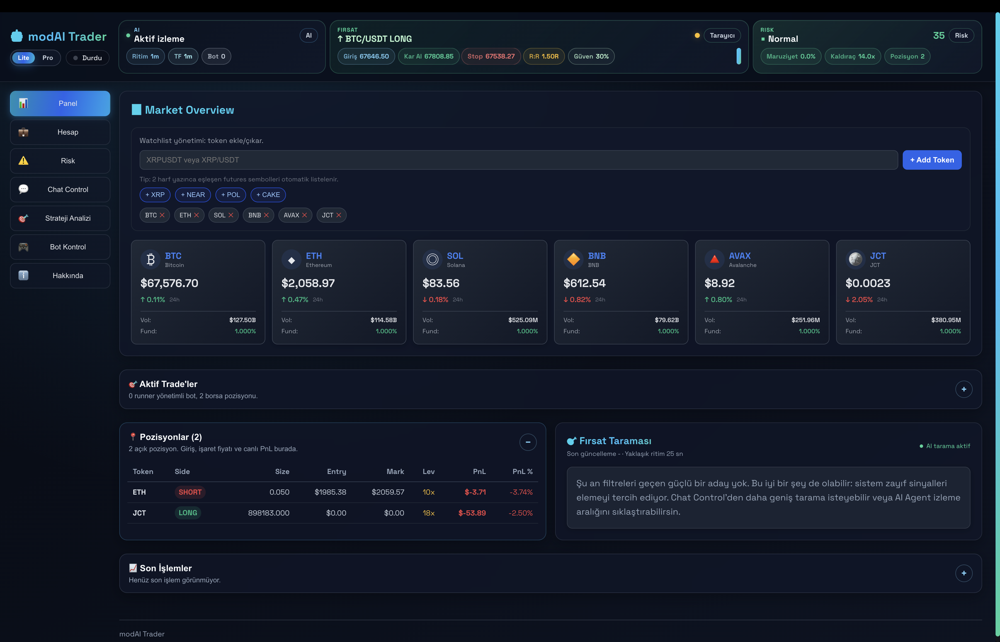

---

## ✨ Features

### 🤖 AI-Powered Trading
- **Advanced AI Agent** with real-time market analysis
- **Automated Position Monitoring** and management
- **Intelligent Signal Generation** with confidence scoring
- **Market Sentiment Analysis** for better decisions

### 📊 Professional Analytics
- **Real-time PnL Tracking** and performance metrics
- **Win Rate Analysis** and detailed trade history
- **Advanced Risk Management** dashboard
- **Portfolio Diversification** scoring

### 🔒 Enterprise Security
- **AES-256-GCM Encryption** for API credentials
- **Device-Bound License** system
- **Secure Local Storage** - no external data transmission
- **Military-Grade Security** for your funds

### ⚡ High-Performance Execution
- **Ultra-Low Latency** order execution
- **Multi-Bot Support** for parallel trading
- **Advanced Strategy System** with pre-built templates
- **Kelly Criterion** position sizing

### 🎯 Risk Management
- **Real-time Portfolio Risk** scoring (0-100)
- **Automated Stop-Loss** and take-profit
- **Trailing Stop-Loss** system
- **Emergency Panic Button** for instant exit

### 🔔 Real-Time Notifications
- Browser notifications for trades
- AI signal alerts
- Risk warnings
- Connection status updates

### 🧪 Testnet Support
- Safe testing with fake money
- Easy switch between testnet/mainnet
- Perfect for learning and strategy testing

---

## 🚀 Quick Start

### 📥 Download

**Latest Release: v1.0.1**

| Platform | Download | Size |
|----------|----------|------|
| 🍎 **macOS (Intel)** | [Download `.dmg`](https://github.com/WeAreTheArtMakers/modaitrader/releases/download/v1.0.1/modAI.Trader-1.0.1.dmg) | ~96 MB |
| 🍎 **macOS (Apple Silicon)** | [Download `.dmg`](https://github.com/WeAreTheArtMakers/modaitrader/releases/download/v1.0.1/modAI.Trader-1.0.1-arm64.dmg) | ~91 MB |
| 🪟 **Windows** (64-bit) | [Download `.exe`](https://github.com/WeAreTheArtMakers/modaitrader/releases/download/v1.0.1/modAI.Trader.Setup.1.0.1.exe) | ~74 MB |

### 📦 Installation

#### macOS
1. Download the `.dmg` file
2. Open the downloaded file
3. Drag **modAI Trader** to Applications folder
4. Launch from Applications
5. If Gatekeeper blocks launch ("app is damaged" or "unidentified developer"):
   - First try: right click app -> **Open**
   - Or go to `System Settings -> Privacy & Security` and click **Open Anyway**
   - If your system still blocks startup, use **Sentinel.app** to remove quarantine on the downloaded app bundle, then open again
6. If you see "unidentified developer" warning:
   - Right-click the app → Open
   - Click "Open" in the dialog

#### Windows
1. Download the `.exe` installer
2. Run the installer
3. Follow the installation wizard
4. Launch from Start Menu or Desktop shortcut

### 🔑 Get License Key

To purchase and activate your license:
1. Launch the app and copy your generated `device_id`.
2. Send **$500 USD equivalent** to one of these wallets:
   - `BTC`: `bc1p5qcj6lquhmpy4lz5qzkv4g3th6zh9keh5xdye5mt09k2fzmtd0ysucwhzs`
   - `ETH`: `0x748bcF72eFA19eFEf100C5ED382D2c99520f057C`
   - `SOL`: `3X4w9TJSjiQVsQrwhTZ2a7CEKNvgt7QRp15ZtmAd72nj`
   - `BNB`: `0x7aAA6Bf8D0D33D7d26201E0Ad350f2be821f70f1`
   - `MONAD`: `0x748bcF72eFA19eFEf100C5ED382D2c99520f057C`
3. Email **admin@wearetheartmakers.com** with:
   - Your `device_id`
   - Transaction hash (TXID)
   - Which network/coin you used
4. Receive your device-bound license key.
5. Enter the key in the app and click **Activate License**.
6. License keys are generated per device ID, so use the exact device ID shown in your app.

**License Features:**
- ✅ Lifetime validity
- ✅ One-time payment
- ✅ Device-bound for security
- ✅ All features included
- ✅ Free updates

### ⚙️ Setup

1. **Launch the App**
   - The app will start automatically

2. **Enter License Key**
   - Paste your license key when prompted
   - Click "Activate"

3. **Get Binance API Keys**
   - **Testnet** (recommended for beginners): [testnet.binancefuture.com](https://testnet.binancefuture.com)
   - **Mainnet** (real trading): [binance.com/api-management](https://www.binance.com/en/my/settings/api-management)

4. **Configure API Credentials**
   - Go to "Bot Control" tab
   - Choose mode: 🧪 Testnet or 🔴 Mainnet
   - Enter API Key and Secret
   - Click "Save Credentials"

5. **Start Trading!**
   - Select a strategy template
   - Choose your trading pair (e.g., BTC/USDT)
   - Click "Start Bot"

---

## 📖 User Guide

### Getting Started

#### 1. Dashboard Overview
- **Account Balance**: Real-time balance and PnL
- **Active Positions**: Current open trades
- **Performance Metrics**: Win rate, total trades, profit
- **Risk Score**: Portfolio risk level (0-100)

#### 2. AI Agent
- **Market Analysis**: Real-time market insights
- **Signal Generation**: AI-powered trade signals
- **Position Monitoring**: Automated position management
- **Confidence Scoring**: Signal reliability (0-100%)

#### 3. Risk Management
- **Portfolio Risk**: Overall risk exposure
- **Position Sizing**: Automatic Kelly Criterion
- **Stop Loss**: Automated risk protection
- **Diversification**: Multi-symbol trading

#### 4. Strategy Templates
- **Conservative (10x)**: Low risk, steady gains
- **Balanced (20x)**: Medium risk/reward
- **Aggressive (50x)**: High risk, high reward
- **Ultra Aggressive (100x)**: Maximum leverage
- **Liquidation Hunter**: Catch liquidation cascades
- **Swing Trader**: Multi-day positions
- **Contrarian Scalper**: Counter-trend scalping

### Best Practices

#### ⚠️ Risk Warning
- **Start with Testnet**: Always test strategies first
- **Use Stop Losses**: Never trade without protection
- **Manage Position Size**: Don't risk more than 1-2% per trade
- **Diversify**: Don't put all funds in one position
- **Monitor Regularly**: Check your positions daily

#### 🎯 Trading Tips
- **Test First**: Use testnet for at least 1 week
- **Start Small**: Begin with minimum position sizes
- **Use AI Signals**: Let AI guide your decisions
- **Follow Risk Score**: Keep it below 50 for safety
- **Set Notifications**: Enable browser alerts

#### 🔒 Security Tips
- **API Permissions**: Only enable "Reading" and "Futures"
- **Never Share Keys**: Keep API keys private
- **Use Testnet First**: Practice before real trading
- **Backup License**: Save your license key safely
- **Update Regularly**: Keep the app updated

---

## 📊 Screenshots

### Trading Workspace

| Dashboard | Account |
|---|---|
|  | 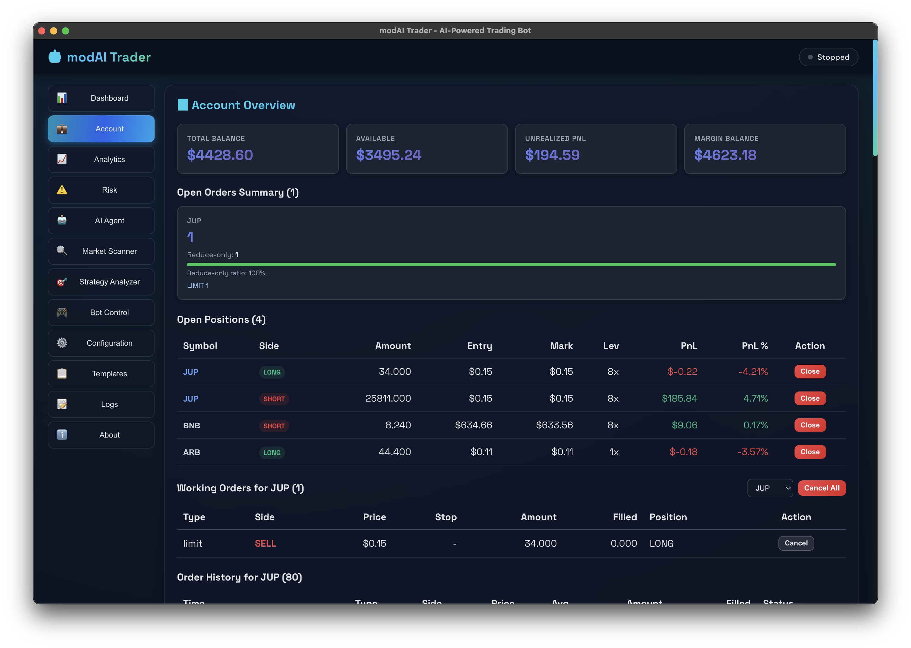 |
| 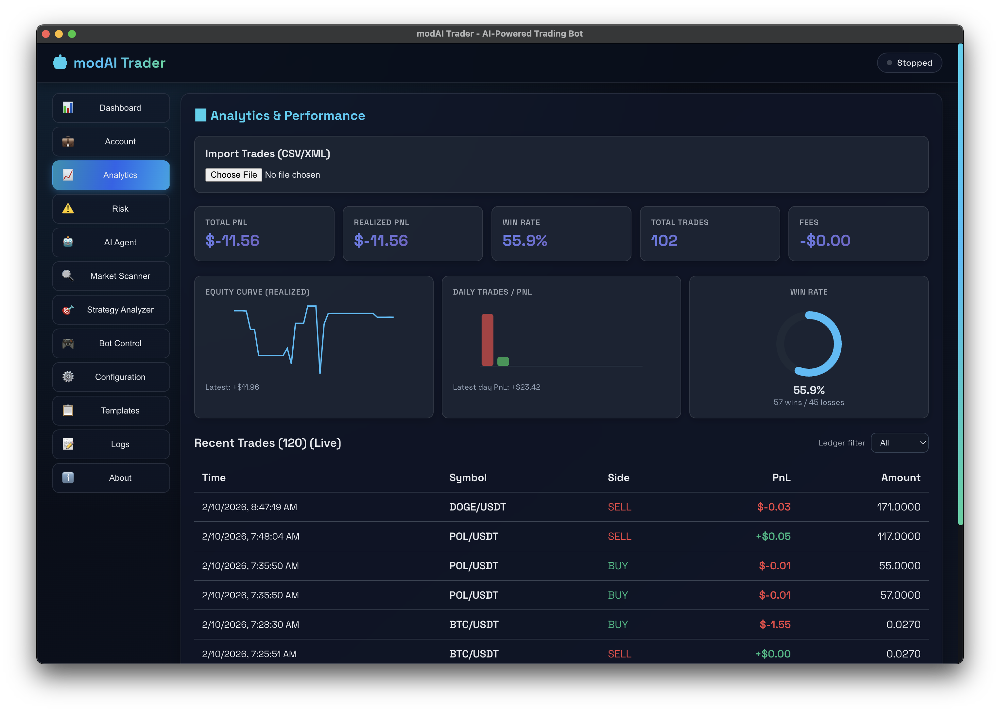 | 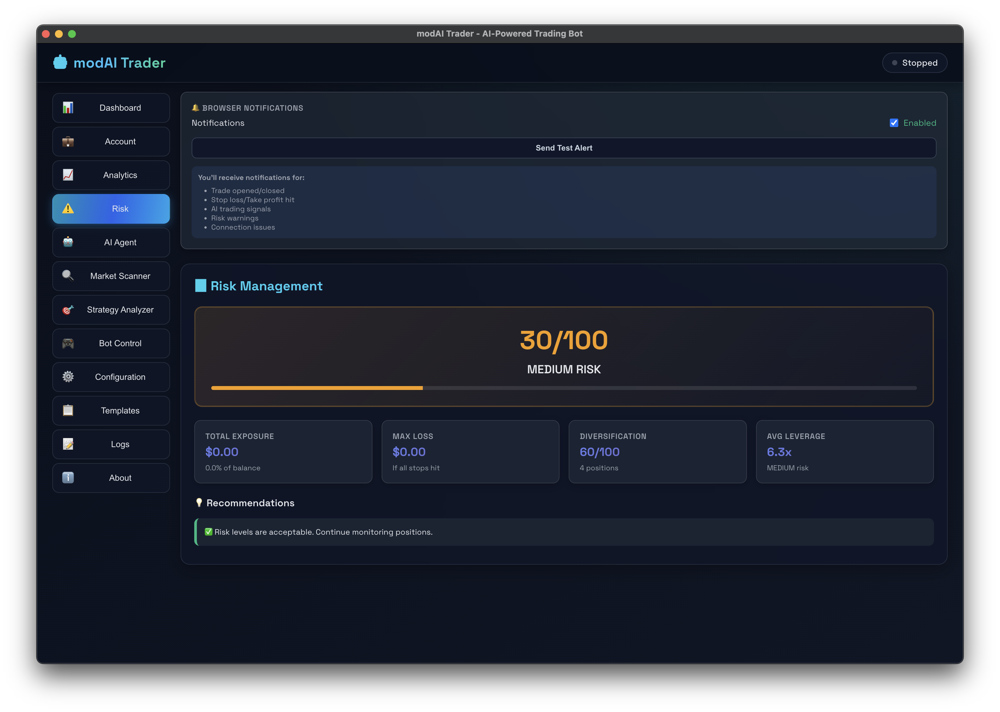 |

### Strategy & Execution

| AI Agent | Market Scanner |
|---|---|
| 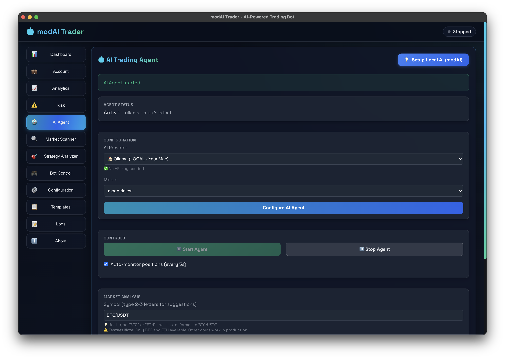 | 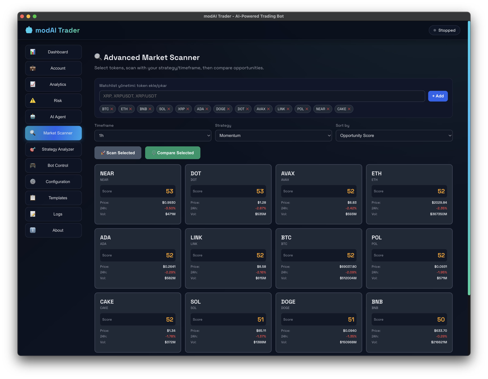 |
| 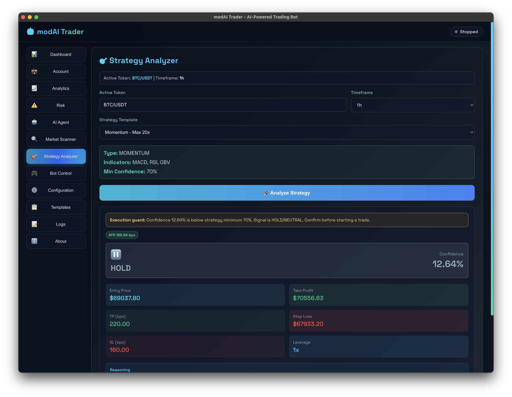 | 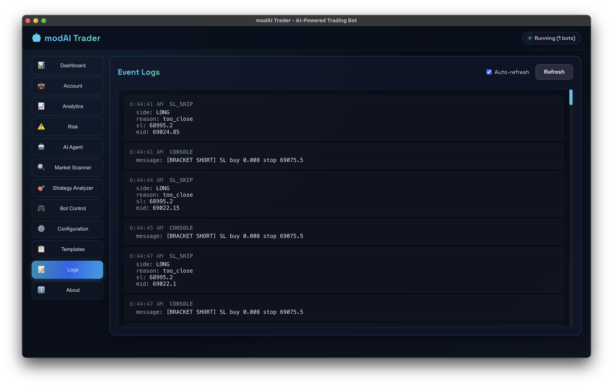 |
| 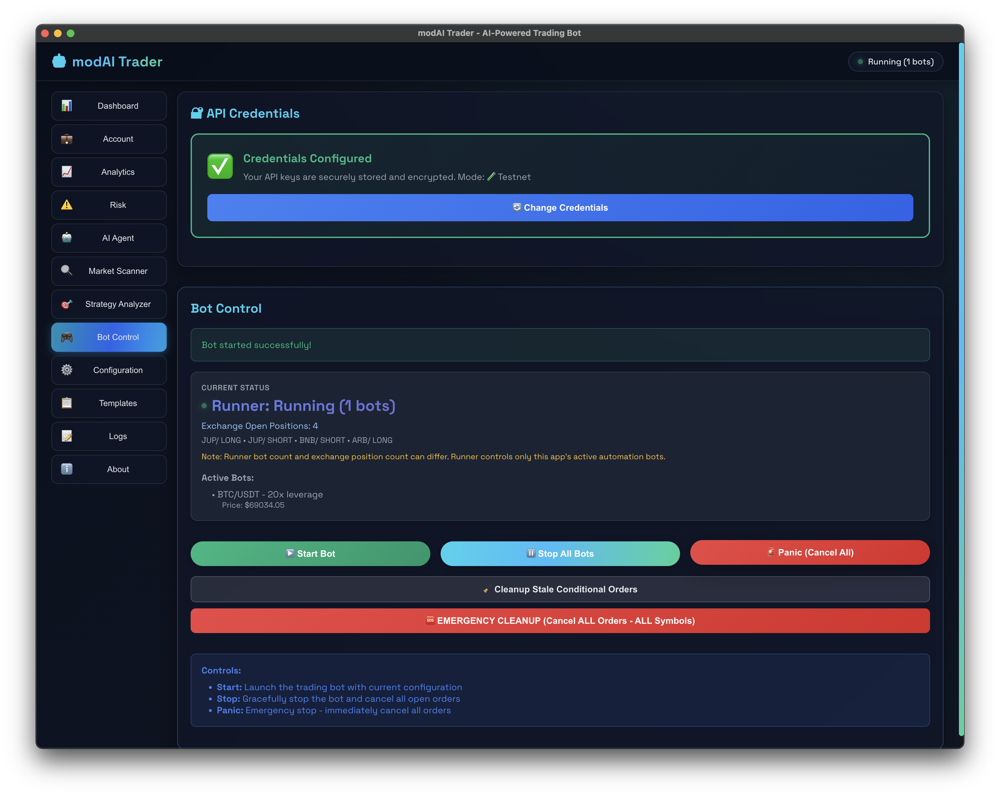 | 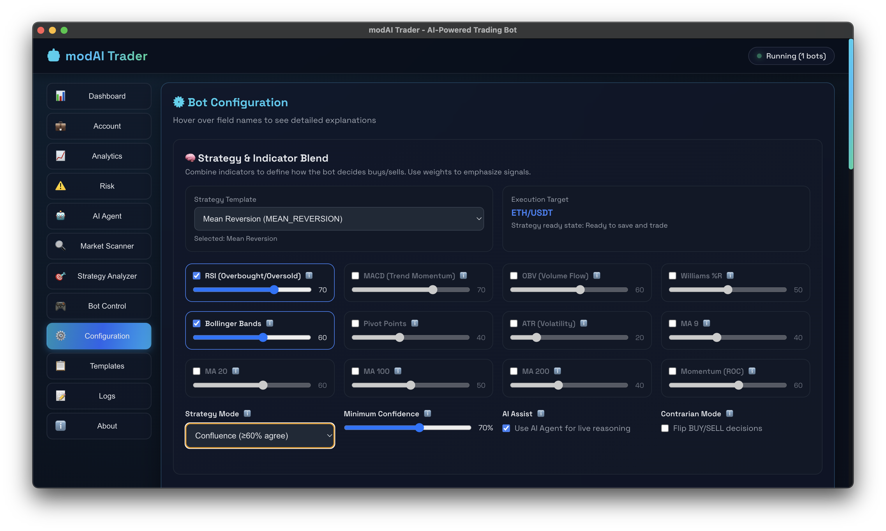 |

### Configuration & Support

| Configuration | Logs |
|---|---|
| 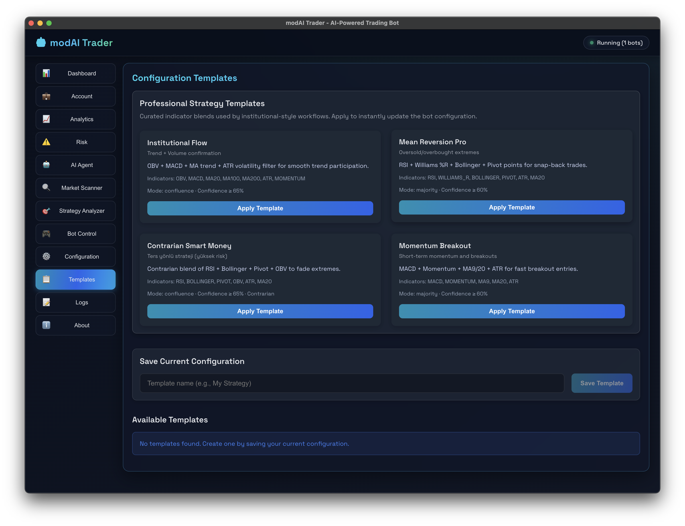 | 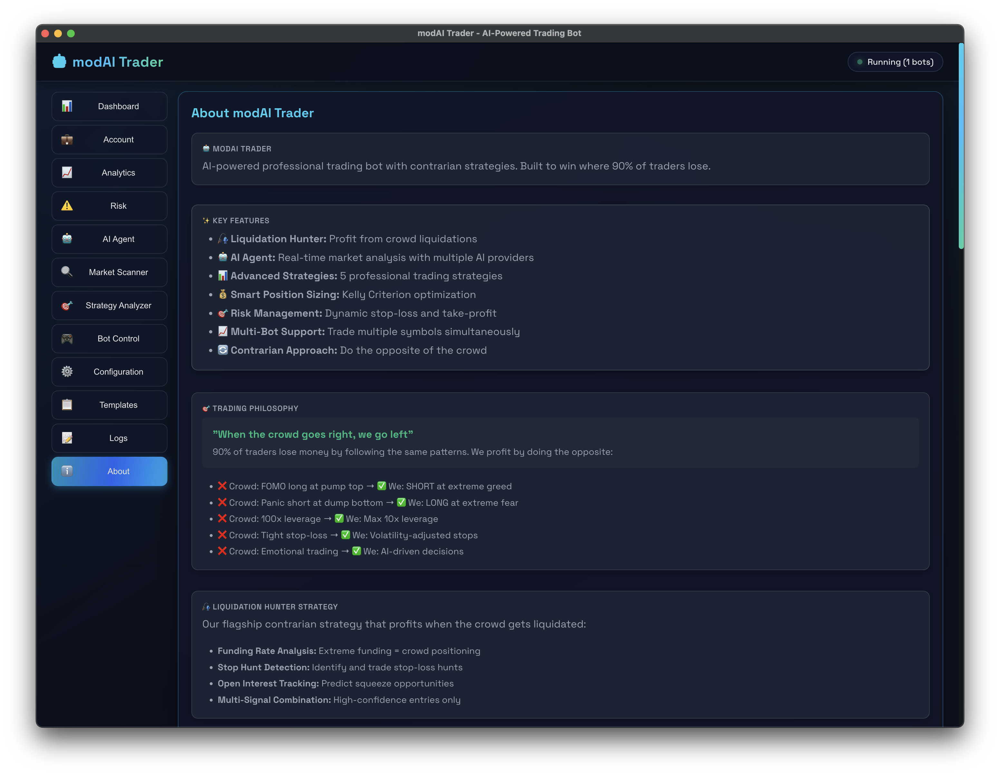 |
| 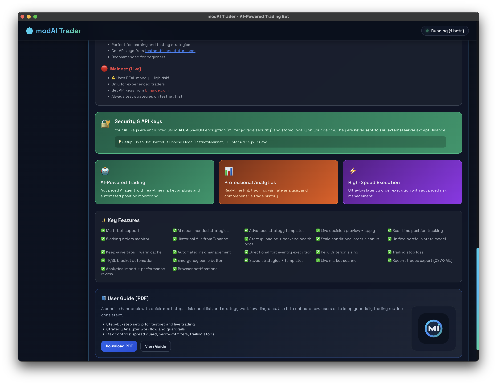 | 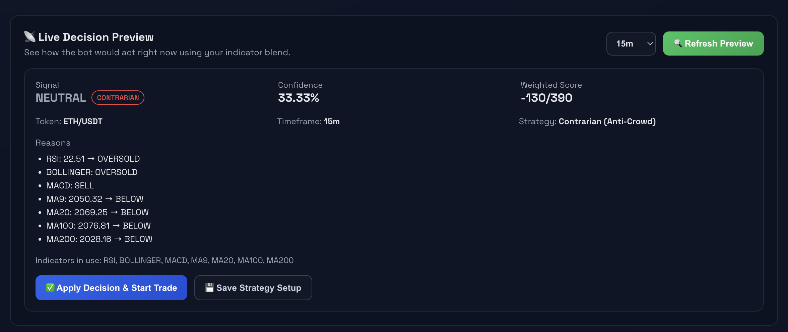 |

---

## 🔐 Security & Privacy

### Data Security
- ✅ **Local Storage Only**: All data stored on your device
- ✅ **AES-256-GCM Encryption**: Military-grade encryption
- ✅ **No External Servers**: Direct connection to Binance only
- ✅ **Release-Only Distribution**: This repository publishes installers only

### API Permissions
Required Binance API permissions:
- ✅ **Enable Reading**: View account data
- ✅ **Enable Futures**: Trade futures
- ❌ **Enable Withdrawals**: NOT required (safer)

### License System
- **Device-Bound**: One license per device
- **Secure Activation**: Hardware-based verification
- **Lifetime Validity**: No recurring fees
- **Transfer Policy**: Contact us for device changes

---

## 💡 FAQ

### General Questions

**Q: Do I need coding knowledge?**
A: No! The app has a user-friendly interface. Just click and trade.

**Q: Is my money safe?**
A: Your funds stay in your Binance account. We never have access to your funds.

**Q: Can I use multiple bots?**
A: Yes! Run multiple strategies simultaneously.

**Q: What's the minimum deposit?**
A: Binance Futures minimum is ~$10 USDT, but we recommend $100+ for proper risk management.

### Technical Questions

**Q: Which operating systems are supported?**
A: macOS (Intel + Apple Silicon) and Windows (64-bit).

**Q: Do I need to keep the app running?**
A: Yes, the app must be running for the bot to trade.

**Q: Can I run it on a VPS?**
A: Not currently. Desktop app only.

**Q: What's the difference between testnet and mainnet?**
A: Testnet uses fake money for practice. Mainnet uses real money.

### Licensing Questions

**Q: How much does a license cost?**
A: **$500 USD**, one-time payment, lifetime validity.

**Q: Can I transfer my license?**
A: Contact us if you change devices. One transfer allowed.

**Q: Is there a free trial?**
A: Use testnet mode to test all features with fake money.

**Q: Do I get updates?**
A: Yes! All updates are free for license holders.

---

## 🛠️ System Requirements

### Minimum
- **OS**: macOS 10.15+ or Windows 10+
- **CPU**: 2 cores
- **RAM**: 4 GB
- **Storage**: 1 GB free space
- **Internet**: Stable connection

### Recommended
- **OS**: macOS 12+ or Windows 11+
- **CPU**: 4+ cores
- **RAM**: 8+ GB
- **Storage**: 5 GB free space
- **Internet**: Low-latency connection (<100ms to Binance)

---

## 🤝 Support

### Get Help

- 📖 **Documentation**: [Read the docs](docs/)
- 🐛 **Bug Reports**: [Open an issue](https://github.com/WeAreTheArtMakers/modaitrader/issues)
- 💬 **Discord**: [Join our community](https://discord.gg/watam)
- 📧 **Email**: admin@wearetheartmakers.com

### Contact Us

- **License Inquiries**: admin@wearetheartmakers.com
- **Technical Support**: admin@wearetheartmakers.com
- **General Questions**: admin@wearetheartmakers.com

---

## 📝 License

**WATAM License** - WeAreTheArtMakers

This software is proprietary and requires a valid license key.

### Terms
- ✅ Personal use with valid license
- ✅ Commercial use with valid license
- ❌ Redistribution prohibited
- ❌ Reverse engineering prohibited
- ❌ License system modification prohibited

For licensing inquiries: admin@wearetheartmakers.com

---

## 🎉 Credits

### Built with ❤️ by WeAreTheArtMakers

**Development Team:**
- AI & Trading Logic
- Security & Encryption
- UI/UX Design
- Risk Management Systems

**Technologies:**
- Python (Backend)
- React (Frontend)
- Electron (Desktop App)
- Binance API (Exchange)

---

## ⭐ Show Your Support

If you find this project useful:
- ⭐ Star the repository
- 🐛 Report bugs
- 💡 Suggest features
- 📖 Share with friends

---

**Made with ❤️ by WeAreTheArtMakers**

*Professional AI-Powered Trading Bot*

[Download](https://github.com/WeAreTheArtMakers/modaitrader/releases) • [Documentation](docs/) • [Support](https://discord.gg/watam)

---

⚠️ **Risk Warning**: Trading cryptocurrencies involves substantial risk of loss. Only trade with money you can afford to lose. Past performance does not guarantee future results.

