# 🤖 modAI Trader

> Professional AI-Powered Trading Bot for Binance Futures

  
   
   
  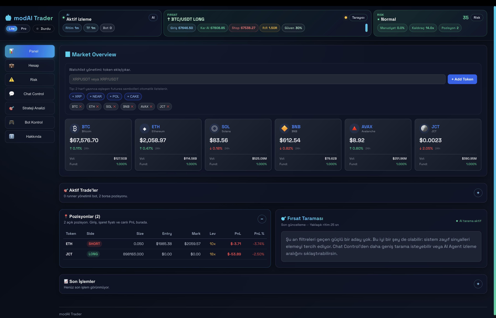

---

## ✨ Features

### 🤖 AI-Powered Trading
- **Advanced AI Agent** with real-time market analysis
- **Automated Position Monitoring** and management
- **Intelligent Signal Generation** with confidence scoring
- **Market Sentiment Analysis** for better decisions
- **Chat to Control** with advisory-first copilot flow, approval-based execution, and trigger lifecycle (create/edit/cancel/execute)
- **Natural Follow-Up Context** so the assistant keeps the active symbol/session context in ongoing chat
- **Vision Chart Review** with structured Entry / TP / SL blocks and bilingual summary output

### 📊 Professional Analytics
- **Real-time PnL Tracking** and performance metrics
- **Win Rate Analysis** and detailed trade history
- **Advanced Risk Management** dashboard
- **Portfolio Diversification** scoring

### 🔒 Enterprise Security
- **AES-256-GCM Encryption** for API credentials
- **Device-Bound License** system
- **Secure Local Storage** - no external data transmission
- **Military-Grade Security** for your funds

### ⚡ High-Performance Execution
- **Ultra-Low Latency** order execution
- **Multi-Bot Support** for parallel trading
- **Advanced Strategy System** with pre-built templates
- **Kelly Criterion** position sizing
- **Safe Startup + Performance Watchdog** to reduce launch-time load spikes and keep the desktop app responsive
- **Unified Snapshot + Streamed Dashboard Data** for faster initial load and cleaner runtime behavior

### 🎯 Risk Management
- **Real-time Portfolio Risk** scoring (0-100)
- **Automated Stop-Loss** and take-profit
- **Trailing Stop-Loss** system
- **Emergency Panic Button** for instant exit
- **Risk Approval Step 2** in Chat Control for high-risk executions
- **Hard Budget Cap + Direction Lock** controls in Bot Control
- **Live Guard State Panel** (spread/portfolio/budget/min-notional counters)
- **One-click "Why didn't trade open?"** debug reason in Chat Control
- **Session Memory + Quick Chips** for symbol/budget/timeframe shortcuts in Chat Control
- **Duplicate Request Guard** (anti-repeat window)
- **Response Cards** with Signal / Risk / Reason / Next Action
- **Confidence Progress Bar + Apply as Preset** in chat responses
- **Spread Presets** with strategy-based guard thresholds for Scalping / Momentum / Swing
- **Entry Quality Score** with spread / micro-volatility / confidence / budget fit breakdown
- **Override Audit Trail** so forced entries show which guard was overridden and why

### 🧠 Workflow Experience
- **Lite Mode / Pro Mode** interface switch for simpler onboarding vs full control
- **AI Agent Status Awareness** inside Chat Control with setup guidance when the copilot is not configured
- **Real Provider Streaming** support for Ollama / Google / OpenAI where available, with fallback labeling
- **Performance State Panel** for safe / degrade / cpu watchdog visibility
- **Header Live Strip** with compact AI / opportunity / risk radar that stays visible across tabs
- **Compact / Balanced / Accessible** top-strip density modes for faster reading
- **Bell / Cash / Soft** alert sound profiles with one-click sound test
- **Fresh / Aging / Stale** opportunity freshness indicator for top-strip candidates
- **Shared AI Context** between AI Agent, Scanner, Dashboard, and Chat Control so follow-up actions stay coherent

### 🔔 Real-Time Notifications
- Browser notifications for trades
- AI signal alerts
- Risk warnings
- Connection status updates

### 🧪 Testnet Support
- Safe testing with fake money
- Easy switch between testnet/mainnet
- Perfect for learning and strategy testing

---

## 🧭 What This App Does

modAI Trader is a desktop application that combines:
- A local Python trading engine
- A React/Electron user interface
- Binance Futures connectivity (Testnet and Mainnet)
- AI-assisted signal, risk, and portfolio monitoring

The app helps users run strategy-based futures trading with live analytics, controlled risk rules, and license-based access.

---

## 🚀 Quick Start

### 📥 Download

**Latest Release: v1.0.16**

| Platform | Download | Size |
|----------|----------|------|
| 🍎 **macOS (Intel)** | [Download from latest release](https://github.com/WeAreTheArtMakers/modaitrader/releases/latest) | ~96 MB |
| 🍎 **macOS (Apple Silicon)** | [Download from latest release](https://github.com/WeAreTheArtMakers/modaitrader/releases/latest) | ~89 MB |
| 🪟 **Windows** (64-bit Installer) | [Download from latest release](https://github.com/WeAreTheArtMakers/modaitrader/releases/latest) | ~80 MB |
| 🪟 **Windows** (64-bit Portable) | [Download from latest release](https://github.com/WeAreTheArtMakers/modaitrader/releases/latest) | ~113 MB |
| 🐧 **Linux x64** | [Download from latest release](https://github.com/WeAreTheArtMakers/modaitrader/releases/latest) | ~113 MB |
| 🐧 **Linux ARM64** (Raspberry Pi 5) | [Download from latest release](https://github.com/WeAreTheArtMakers/modaitrader/releases/latest) | ~113 MB |

### 📦 Installation

#### macOS
1. Download the `.dmg` file
2. Open the downloaded file
3. Drag **modAI Trader** to Applications folder
4. Launch from Applications
5. Use the Apple Silicon build on M-series Macs and the Intel build on older Macs
5. If Gatekeeper blocks launch ("app is damaged" or "unidentified developer"):
   - First try: right click app -> **Open**
   - Or go to `System Settings -> Privacy & Security` and click **Open Anyway**
   - If your system still blocks startup, use **Sentinel.app** to remove quarantine on the downloaded app bundle, then open again
6. If you see "unidentified developer" warning:
   - Right-click the app → Open
   - Click "Open" in the dialog

#### Windows
1. Download the `.exe` installer
2. Run the installer
3. Follow the installation wizard
4. Launch from Start Menu or Desktop shortcut
5. If Windows shows "could not access the file/device/path":
   - Move installer from cloud-synced folder to `C:\Users\<you>\Desktop`
   - Right click file -> **Properties** -> **Unblock** (if visible)
   - Run as Administrator
   - If still blocked, use the **portable `.zip`** package from the same release

#### Linux (x64 / ARM64 Raspberry Pi 5)
1. Download the matching `.AppImage` file
2. Open terminal in the download folder
3. Run: `chmod +x "modAI Trader-1.0.16-arm64.AppImage"` (or x64 file)
4. Launch: `./modAI Trader-1.0.16-arm64.AppImage` (or x64 file)
5. If required, install base libraries (`libnss3`, `libgtk-3-0`, `libxss1`)

### 🔑 License Plans & Activation

modAI Trader uses device-ID based licensing.

**Current Plans**
- Trial 5 Days: Free
- Monthly: $250
- Yearly: $2700
- One-Time Lifetime: $5000

**How activation works**
1. Launch the app and copy your generated `device_id`.
2. Choose a plan.
3. Contact **studiobrn@gmail.com** with your device ID and payment reference for paid plans.
4. Receive your device-bound license key.
5. Enter the key in the app and activate.
6. Trial users can upgrade to Monthly/Yearly/Lifetime on the same Device ID.

### 🔄 Updates

- **Check for Updates** in the About screen checks the latest GitHub Release and opens the correct asset for your platform.
- macOS users get the latest `.dmg`, Windows users get the latest installer/portable package, and Linux users get the latest `.AppImage`.
- Important: every public release must use a **new semantic version tag**. Re-uploading files under the same version will not appear as an update to existing users.

### 🆕 Highlights in 1.0.16

- Chat Control now behaves more like an autonomous trading copilot:
  broad approval-ready prompts return a final answer directly, and if no clean setup qualifies the app can prepare `ANY`-direction or timed follow-up triggers so the user does not need to ask again
- Follow-up visibility is stronger across the app:
  `Next run`, `Resolved side`, and fired-trigger state are now surfaced in Chat Control and the persistent top strip for faster operator awareness
- Market Regime is now a real global behavior layer:
  regime source selection, live breadth summary, posture details, and refreshed market snapshots are handled as a whole-market control rather than a single-symbol view
- Liq Hunter and scanner behavior are cleaner and more actionable:
  incomplete liquidation setups no longer look executable, scanner state is lighter, watchlist editing is more isolated, and heavy list rendering has been reduced
- Runtime stability for long sessions is stronger:
  backend session cleanup was hardened, runtime telemetry now includes memory and cache-maintenance signals, and idle cache compaction helps the app stay responsive over longer uptime
- Desktop update behavior is safer:
  update checks run later in startup, use platform-aware asset selection, and now apply backoff when GitHub is slow or unreachable
- English/Turkish consistency is deeper:
  deterministic trade suggestions, follow-up messages, and approval-related assistant text now track the selected UI language more reliably

**License Features**
- ✅ Device-ID bound activation
- ✅ Secure local validation
- ✅ Trial-to-paid upgrade path
- ✅ Full module unlock after activation
- ✅ Ongoing release updates

### ⚙️ Setup

1. **Launch the App**
   - The app will start automatically

2. **Enter License Key**
   - Paste your license key when prompted
   - Click "Activate"

3. **Get Binance API Keys**
   - **Testnet** (recommended for beginners): [testnet.binancefuture.com](https://testnet.binancefuture.com)
   - **Mainnet** (real trading): [binance.com/api-management](https://www.binance.com/en/my/settings/api-management)

4. **Configure API Credentials**
   - Go to "Bot Control" tab
   - Choose mode: 🧪 Testnet or 🔴 Mainnet
   - Enter API Key and Secret
   - Click "Save Credentials"

5. **Start Trading!**
   - Select a strategy template
   - Choose your trading pair (e.g., BTC/USDT)
   - Click "Start Bot"

---

## 🔑 License Purchase Steps (For Users)

1. Install and launch modAI Trader.
2. On the license activation page, copy your generated `device_id`.
3. Contact `studiobrn@gmail.com` with your device ID and payment reference.
4. Receive your device-bound license key.
5. Enter the key in the app and activate.
6. Start using all features immediately.

---

## 📖 Documentation

Comprehensive documentation is available in the [`docs/`](docs/) folder:

### Getting Started

#### 1. Dashboard Overview
- **Account Balance**: Real-time balance and PnL
- **Active Positions**: Current open trades
- **Performance Metrics**: Win rate, total trades, profit
- **Risk Score**: Portfolio risk level (0-100)

#### 2. AI Agent
- **Market Analysis**: Real-time market insights
- **Signal Generation**: AI-powered trade signals
- **Position Monitoring**: Automated position management
- **Confidence Scoring**: Signal reliability (0-100%)
- **Provider Setup**: Ollama, Google Gemini, or OpenAI based workflows
- **Status-Aware Copilot**: Chat Control warns when AI Agent is not configured or not running

#### 3. Risk Management
- **Portfolio Risk**: Overall risk exposure
- **Position Sizing**: Automatic Kelly Criterion
- **Stop Loss**: Automated risk protection
- **Diversification**: Multi-symbol trading

#### 4. Strategy Templates
- **Conservative (10x)**: Low risk, steady gains
- **Balanced (20x)**: Medium risk/reward
- **Aggressive (50x)**: High risk, high reward
- **Ultra Aggressive (100x)**: Maximum leverage
- **Liquidation Hunter**: Catch liquidation cascades
- **Swing Trader**: Multi-day positions
- **Contrarian Scalper**: Counter-trend scalping

#### 5. Chat Control Copilot
- **Assistant-first flow**: strategy questions return guidance, not immediate trade proposals
- **Trade intent gating**: only clear execution commands create approval cards
- **Single-output conversation design**: one primary answer per user message
- **Session continuity**: follow-up questions keep the last relevant symbol/context
- **Chart vision workflow**: upload a chart, get structured analysis, then convert it into a trade plan

### Best Practices

#### ⚠️ Risk Warning
- **Start with Testnet**: Always test strategies first
- **Use Stop Losses**: Never trade without protection
- **Manage Position Size**: Don't risk more than 1-2% per trade
- **Diversify**: Don't put all funds in one position
- **Monitor Regularly**: Check your positions daily

#### 🎯 Trading Tips
- **Test First**: Use testnet for at least 1 week
- **Start Small**: Begin with minimum position sizes
- **Use AI Signals**: Let AI guide your decisions
- **Follow Risk Score**: Keep it below 50 for safety
- **Set Notifications**: Enable browser alerts

#### 🔒 Security Tips
- **API Permissions**: Only enable "Reading" and "Futures"
- **Never Share Keys**: Keep API keys private
- **Use Testnet First**: Practice before real trading
- **Backup License**: Save your license key safely
- **Update Regularly**: Keep the app updated

---

## 📊 Screenshots

### Trading Workspace

| Dashboard | Account |
|---|---|
|  | 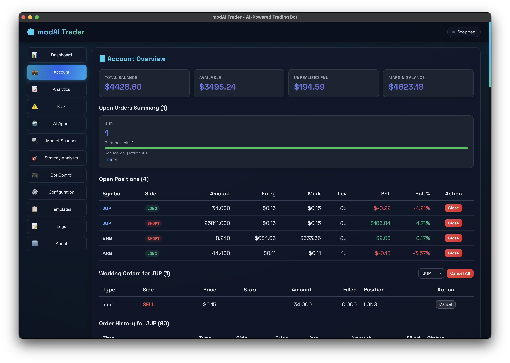 |
| 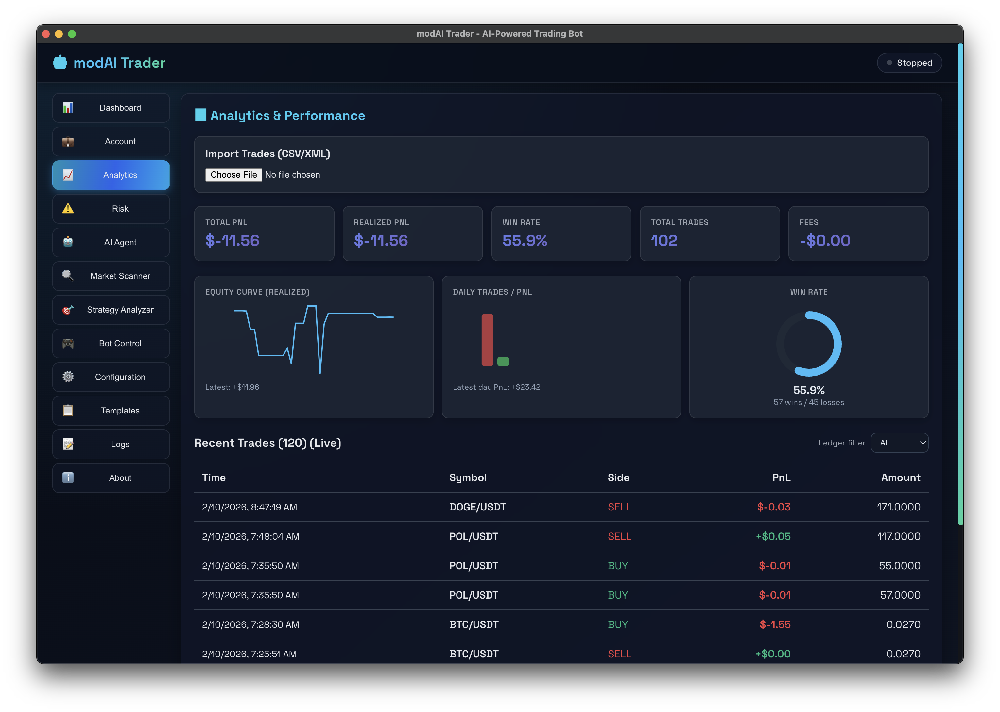 | 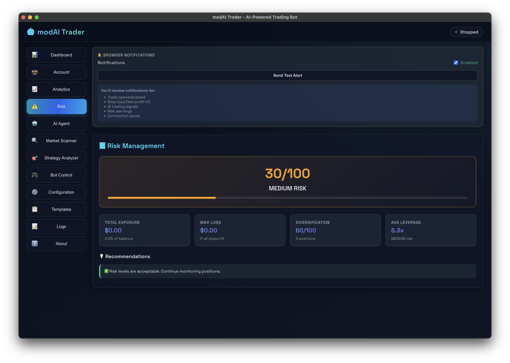 |

### Strategy & Execution

| AI Agent | Chat Control |
|---|---|
| 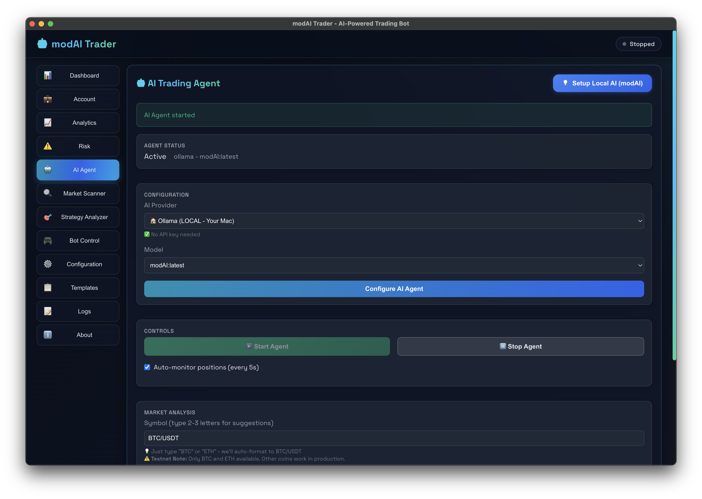 | 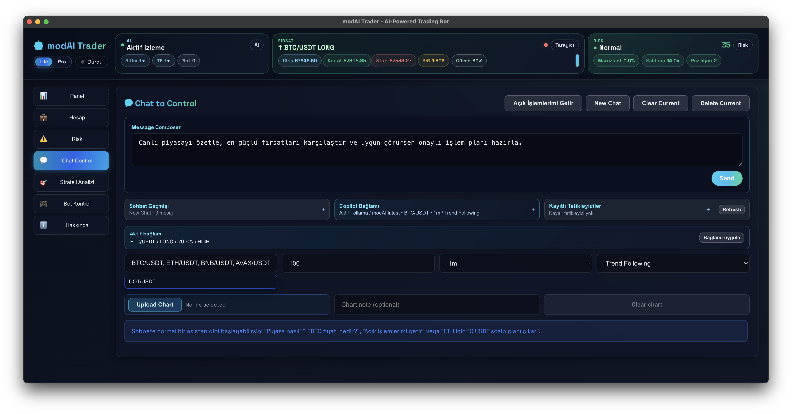 |
| 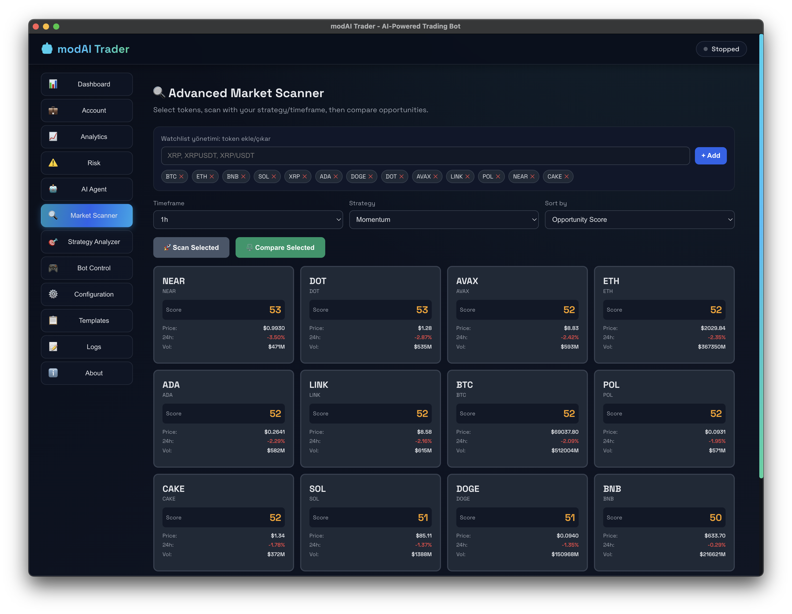 | 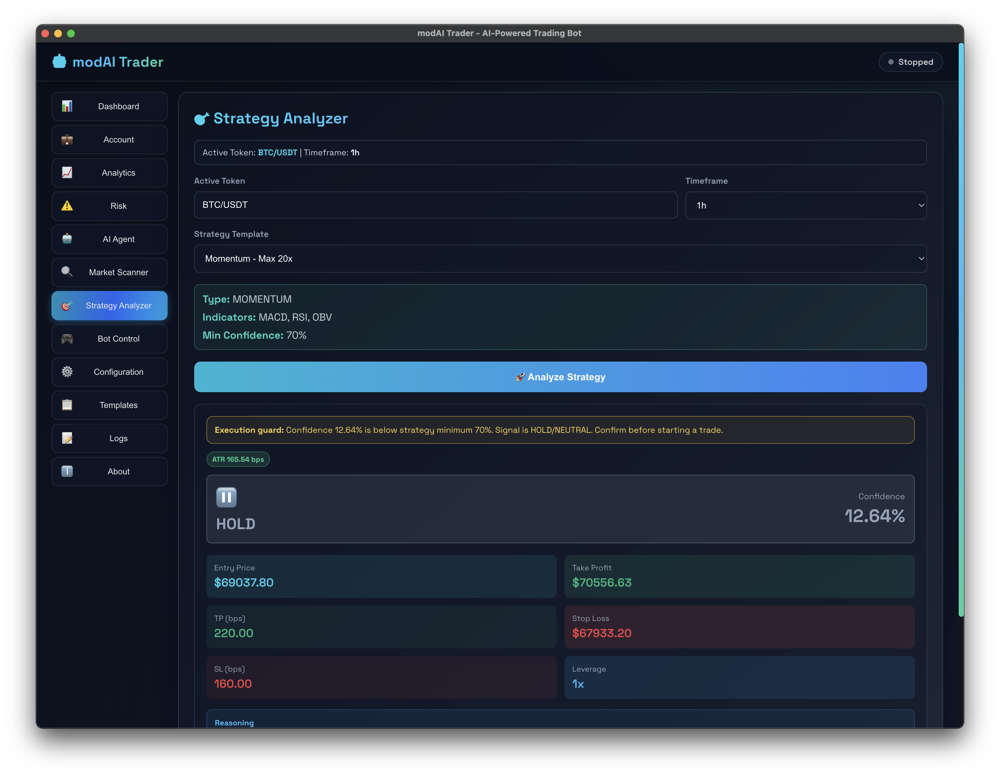 |
| 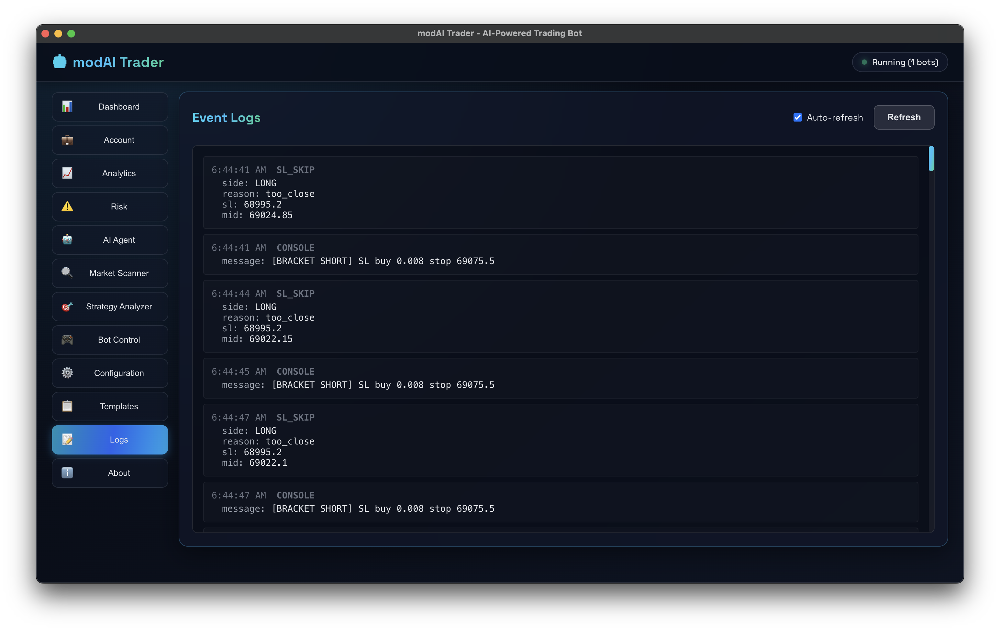 | 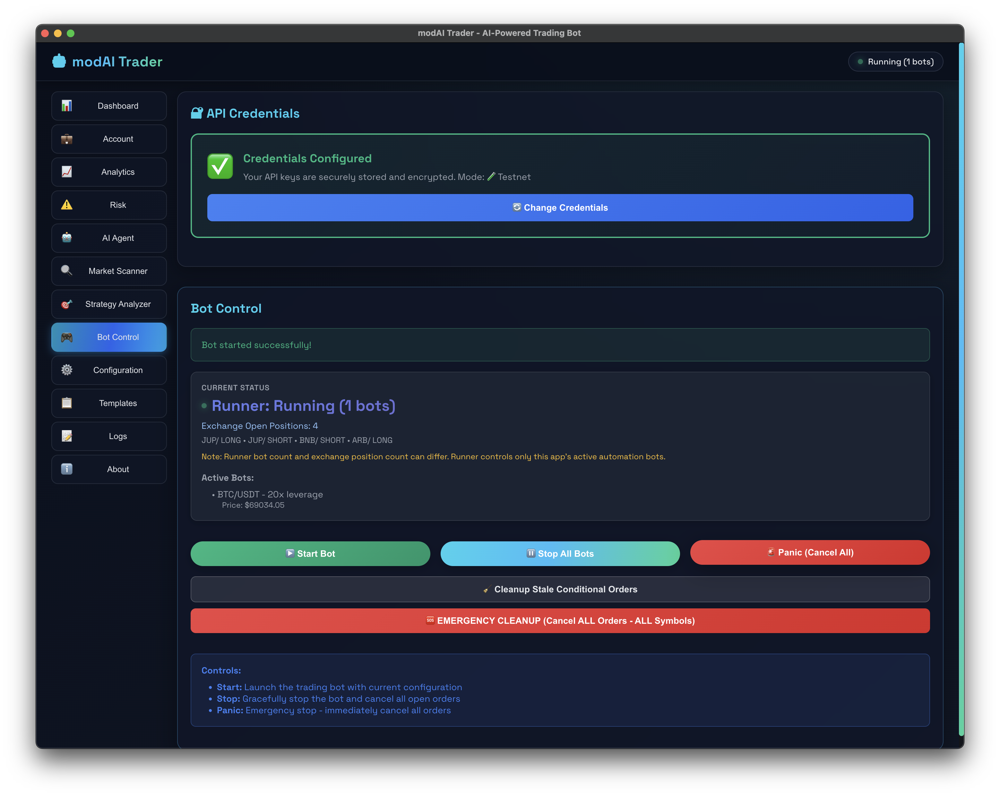 |
| 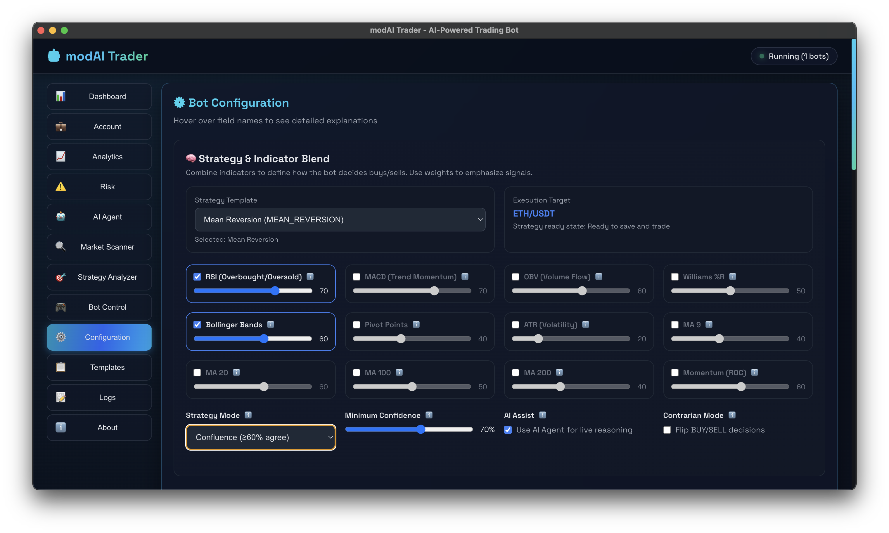 | 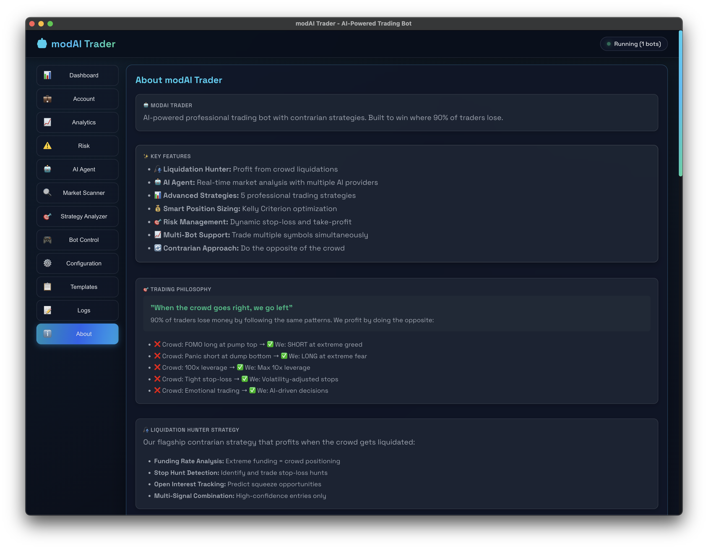 |

### Configuration & Support

| Configuration | About |
|---|---|
| 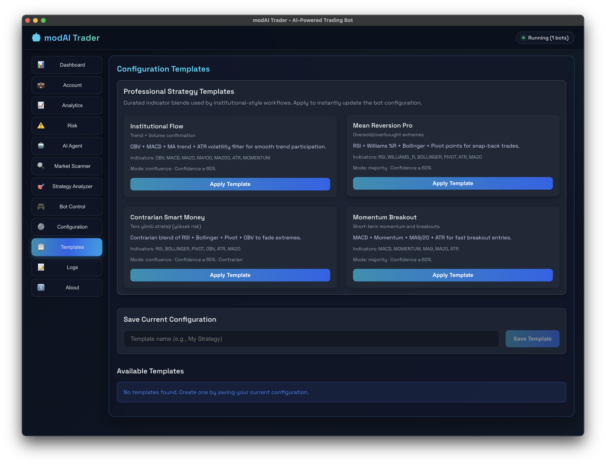 |  |
| 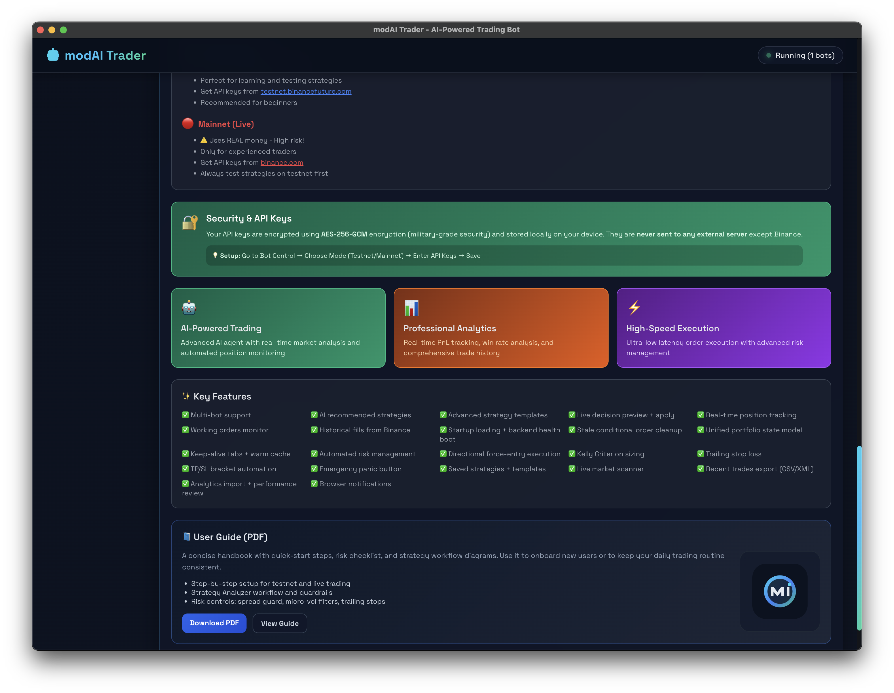 | 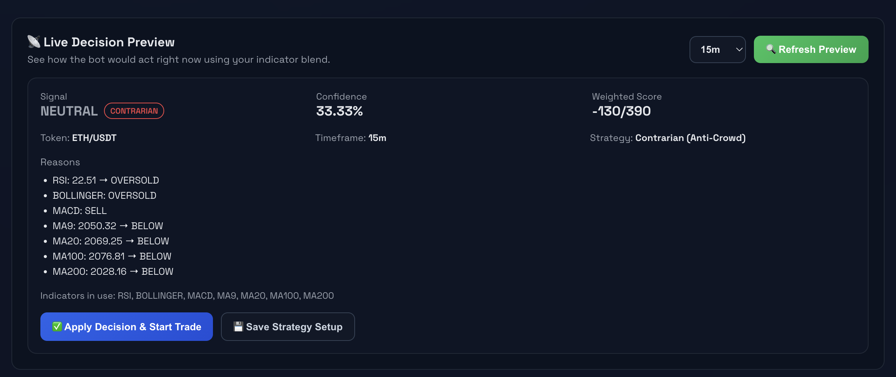 |

---

## 🔐 Security & Privacy

### Data Security
- ✅ **Local Storage Only**: All data stored on your device
- ✅ **AES-256-GCM Encryption**: Military-grade encryption
- ✅ **No External Servers**: Direct connection to Binance only
- ✅ **Release-Only Distribution**: This repository publishes installers only

### API Permissions
Required Binance API permissions:
- ✅ **Enable Reading**: View account data
- ✅ **Enable Futures**: Trade futures
- ❌ **Enable Withdrawals**: NOT required (safer)

### License System
- **Device-Bound**: One license per Device ID
- **Secure Activation**: Hardware-based verification
- **Plan Options**: Trial 5 Days, Monthly, Yearly, One-Time Lifetime
- **Upgrade Path**: Trial users can move to paid plans on same device
- **Transfer Policy**: Contact us for device changes

---

## 💡 FAQ

### General Questions

**Q: Do I need coding knowledge?**
A: No! The app has a user-friendly interface. Just click and trade.

**Q: Is my money safe?**
A: Your funds stay in your Binance account. We never have access to your funds.

**Q: Can I use multiple bots?**
A: Yes! Run multiple strategies simultaneously.

**Q: What's the minimum deposit?**
A: Binance Futures minimum is ~$10 USDT, but we recommend $100+ for proper risk management.

### Technical Questions

**Q: Which operating systems are supported?**
A: macOS (Intel + Apple Silicon), Windows (64-bit installer + portable), Linux x64, and Linux ARM64 (AppImage, tested for Raspberry Pi 5).

**Q: Do I need to keep the app running?**
A: Yes, the app must be running for the bot to trade.

**Q: Can I run it on a VPS?**
A: Not currently. Desktop app only.

**Q: What's the difference between testnet and mainnet?**
A: Testnet uses fake money for practice. Mainnet uses real money.

### Licensing Questions

**Q: How much does a license cost?**
A: Plans are **Trial 5 Days (Free)**, **Monthly ($250)**, **Yearly ($2700)**, and **One-Time Lifetime ($5000)**.

**Q: Can I transfer my license?**
A: Contact us if you change devices. One transfer allowed.

**Q: Is there a free trial?**
A: Yes. A **5-day trial license** is available and can be upgraded on the same Device ID.

**Q: Do I get updates?**
A: Yes. License holders can use **Check for Updates** from the About screen to open the latest platform-specific build from GitHub Releases.

---

## 🛠️ System Requirements

### Minimum
- **OS**: macOS 10.15+, Windows 10+, or Linux ARM64 (Raspberry Pi OS 64-bit / Ubuntu 22.04+)
- **CPU**: 2 cores
- **RAM**: 4 GB
- **Storage**: 1 GB free space
- **Internet**: Stable connection

### Recommended
- **OS**: macOS 12+, Windows 11+, or Ubuntu 24.04 ARM64 / Raspberry Pi OS Bookworm 64-bit
- **CPU**: 4+ cores
- **RAM**: 8+ GB
- **Storage**: 5 GB free space
- **Internet**: Low-latency connection (<100ms to Binance)

---

## 🤝 Support

### Get Help

- 📖 **Documentation**: [Read the docs](docs/)
- 🐛 **Bug Reports**: [Open an issue](https://github.com/WeAreTheArtMakers/modaitrader/issues)
- 💬 **Discord**: [Join our community](https://discord.gg/watam)
- 📧 **Email**: studiobrn@gmail.com

### Contact Us

- **License Inquiries**: studiobrn@gmail.com
- **Technical Support**: admin@wearetheartmakers.com
- **General Questions**: admin@wearetheartmakers.com

---

## 📝 License

**WATAM License** - WeAreTheArtMakers

This software is proprietary and requires a valid license key.

### Terms
- ✅ Personal use with valid license
- ✅ Commercial use with valid license
- ❌ Redistribution prohibited
- ❌ Reverse engineering prohibited
- ❌ License system modification prohibited

For licensing inquiries: studiobrn@gmail.com

---

## 🎉 Credits

### Built with ❤️ by WeAreTheArtMakers

**Development Team:**
- AI & Trading Logic
- Security & Encryption
- UI/UX Design
- Risk Management Systems

**Technologies:**
- Python (Backend)
- React (Frontend)
- Electron (Desktop App)
- Binance API (Exchange)

---

## ⭐ Show Your Support

If you find this project useful:
- ⭐ Star the repository
- 🐛 Report bugs
- 💡 Suggest features
- 📖 Share with friends

---

**Made with ❤️ by WeAreTheArtMakers**

*Professional AI-Powered Trading Bot*

[Download](https://github.com/WeAreTheArtMakers/modaitrader/releases) • [Documentation](docs/) • [Support](https://discord.gg/watam)

---

⚠️ **Risk Warning**: Trading cryptocurrencies involves substantial risk of loss. Only trade with money you can afford to lose. Past performance does not guarantee future results.

